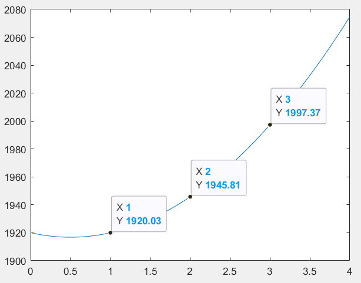
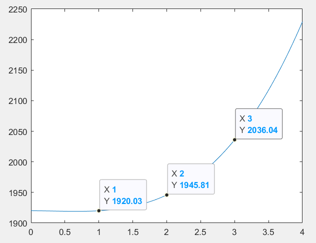
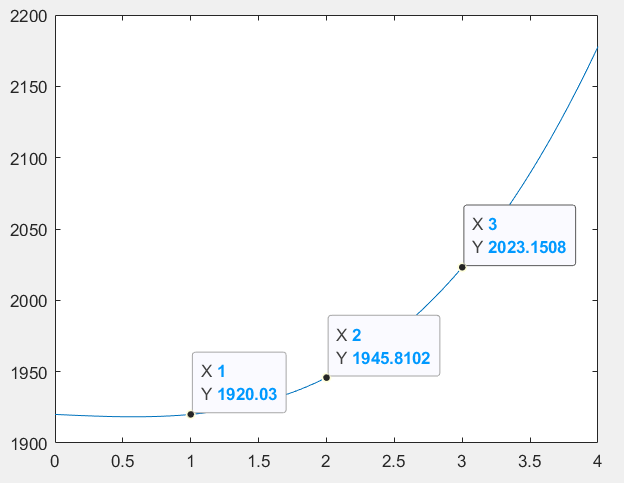
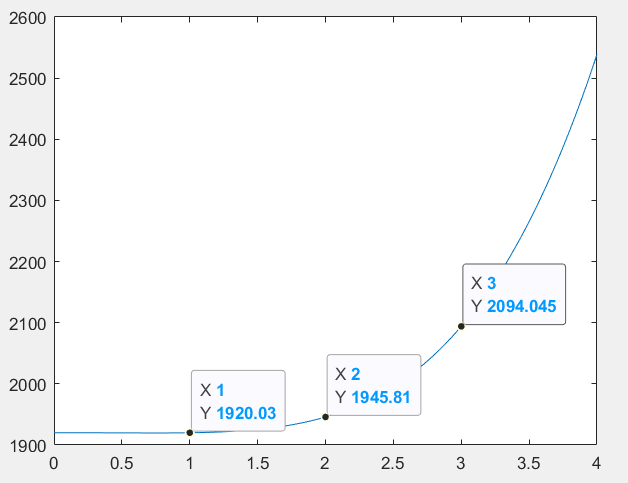
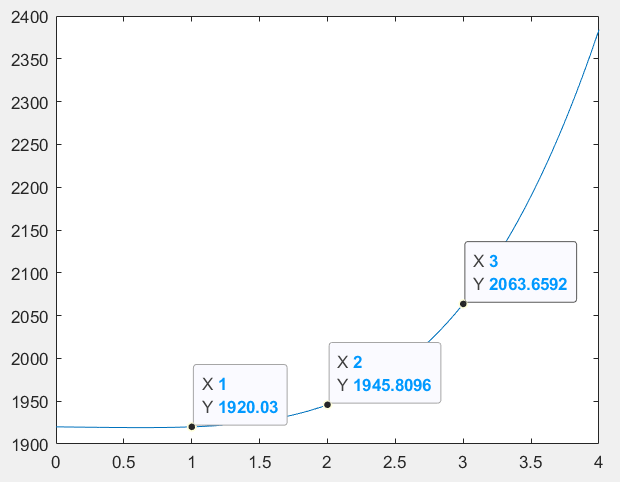
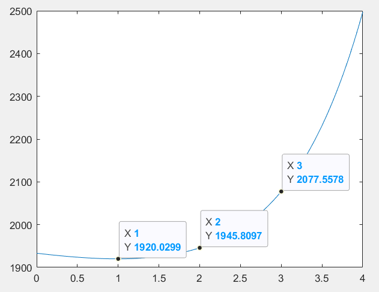

#
插值建模-数值实验报告

数据科学与计算机学院（软件工程） 郑卓民 18342138

## 实验内容：
对递增的2个数据$1920.03$和$1945.81$尝试用各种不同函数、公式或方法进行插值建模，进行外插值/外推计算，以求出该递增2数据的下一个数据（也即第3个数据）是多少？

## 注意事项：
外插值/外推无唯一答案，但该第3个数据理论上大于$2019.79$

## 实验原理：

#### 插值问题：
设$x_{0}, x_{1} \cdots x_{n}$为给定的节点，$y_{i}=f\left(x_{i}\right), \quad i=0,1, \cdots n$为相应的函数值，求一个多项式$P_{n}(x)$，使其满足

$$P_{n}\left(x_{i}\right)=y_{i}, \quad i=0,1, \cdots n$$

由实验内容中提供的两个数据$1920.03$和$1945.81$，我们可以假设出两个插值节点$x_0 = 1$和$x_1 = 2$。（即两点分别为 $(1, 1920.03)$和$(2, 1945.81)$）

## 实验过程：

我们可以对上述两个数据进行多个多项式插值方法的尝试，并分别与给定的理论值做比较来判断所得的对应插值多项式是否合理。

首先，我们可以套用一些已有模型来得到插值多项式来观察效果如何。

#### 尝试拉格朗日插值法：

拉格朗日插值法的通式为：

$p_{k}(x)=\prod_{i \in B_{k}} \frac{x-x_{i}}{x_{k}-x_{i}}$ ， $L_{n}(x)=\sum_{j=0}^{n-1} y_{j} p_{j}(x)$

当$n = 2$时候，插值多项式为：
$f(x)=\frac{\left(x-x_{1}\right)}{\left(x_{0}-x_{1}\right)} y_{0}+\frac{\left(x-x_{0}\right)}{\left(x_{1}-x_{0}\right)} y_{1}$

代入数据得到：$f(x)=1894.25+25.78 x$

代入$x = 3$得： $f(3)=1971.59$

所得结果与理论值相差较远，不符合。

考虑到三个递增数据的增幅呈递增趋势，并结合上面使用拉格朗日插值法求插值多项式的尝试，可知普通的线性插值多项式并不满足实际要求，需要尝试使用特殊的非线性的多项式来进行插值实验。

#### 尝试高次函数模型：

下面的思路是尝试使用不同的非线性函数去拟合已有的两点，得到公式后得到第三个点的值后与实际比较，看是否合理。

##### 二次函数:

**假设**：$f(x) = Ax^2 + Bx + 1920.03$：

代入$(1, 1920.03)$和$(2, 1945.81)$ 得： $\left\{\begin{array}{l}{A+B=0} \\ {4 A+2 B=25.78}\end{array}\right.$

解的：$\left\{\begin{array}{l}{A=12.89} \\ {B=-12.89}\end{array}\right.$

$f(x) = 12.89x^2 - 12.89x + 1920.03$

因此：$f(3)=9 A+3 B+1920.03=1997.4$

结果比线性模型要更贴近实际结果，但仍然不满足理论条件，因此我们可以尝试继续提高变量$x$的幂次。

插值多项式图形如下：

##### 三次函数：

**假设一**：$f(x) = Ax^3 + Bx^2 + 1920.03$：

同上，代入节点可得：$\left\{\begin{array}{l}{A+B=0} \\ {8 A+4 B=25.78}\end{array}\right.$

解的：$\left\{\begin{array}{l}{A=6.4450} \\ {B=-6.4450}\end{array}\right.$

$f(x) = 6.445x^3 - 6.445x^2 + 1920.03$

因此：$f(3)=27 A+9 B+1920.03=2036$

预测结果已符合理论条件。

插值多项式图形如下：

**假设二**：$f(x) = Ax^3 + Bx + 1920.03$：

同上，代入节点可得：$\left\{\begin{array}{l}{A+B=0} \\ {8 A+2 B=25.78}\end{array}\right.$

解的：$\left\{\begin{array}{l}{A=4.2967} \\ {B=-4.2967}\end{array}\right.$

$f(x) = 4.2967x^3 - 4.2967x + 1920.03$

因此：$f(3)=27 A+3 B+1920.03=2023.2$

预测结果已符合理论条件。

插值多项式图形如下：

根据假设一和假设二得结果，可知三次函数模型符合需求的插值多项式模型，根据与理论值的比较可见$f(x) = Ax^3 + Bx + 1920.03$模型要比$f(x) = Ax^3 + Bx^2 + 1920.03$模型更贴合理论值

##### 四次函数：

**假设一**：$f(x) = Ax^4 + Bx^3 + 1920.03$：

同上，代入节点可得：$\left\{\begin{array}{l}{A+B=0} \\ {16 A+8 B=25.78}\end{array}\right.$

解的：$\left\{\begin{array}{l}{A=3.2225} \\ {B=-3.2225}\end{array}\right.$

$f(x) = 3.2225x^4 - 3.2225x^3 + 1920.03$

因此：$f(3)=81 A+27 B+1920.03=2094$

预测结果已符合理论条件，但比$2019.79$要大较多。

插值多项式图形如下：

**假设二**：$f(x) = Ax^4 + Bx + 1920.03$：

同上，代入节点可得：$\left\{\begin{array}{l}{A+B=0} \\ {16 A+2 B=25.78}\end{array}\right.$

解的：$\left\{\begin{array}{l}{A=1.8414} \\ {B=-1.8414}\end{array}\right.$

$f(x) = 1.8414x^4 - 1.8414x + 1920.03$

因此：$f(3)=81 A+3 B+1920.03=2063.7$

预测结果已符合理论条件，比假设一模型所得结果更接近$2019.79$，但差距仍较大。

插值多项式图形如下：

结合上面二、三、四次函数模型的尝试，易推的三次及更高次的函数模型均符合需求，而三次函数模型有可能是弥合程度最高的。

#### 尝试特殊函数模型：

**假设**：$f(x) = Ae^x + Bx + 1920.03$：

同上，代入节点可得：$\left\{\begin{array}{l}{Ae+B=0} \\ { Ae^2+ 2B=25.78}\end{array}\right.$

解的：$\left\{\begin{array}{l}{A=13.2036} \\ {B=-35.8912}\end{array}\right.$

$f(x) = 13.2036e^x - 35.8912x + 1920.03$

因此：$f(3)=2077.6$ ，预测结果符合条件。

插值多项式图形如下：

## 实验总结：

本次实验的重点在于建模，利用已知的两个数据点，构造出一个插值多项式，建模的方法以及函数有多种多样，模型是否符合需求，取决于对于第三个数据点的预测结果是否符合给定的理论参考条件，经过多次尝试，包括线性模型，二次、三次、四次模型、特殊（指数）模型的数值实验，发现：在本题中，线性模型不满足要求，而三次函数即其他增长速率比三次函数高的函数会有不错的预测效果。如果追求科学的简单性原则，那么模型$f(x) = Ax^3 + Bx + 1920.03$将会是不错的选择。
