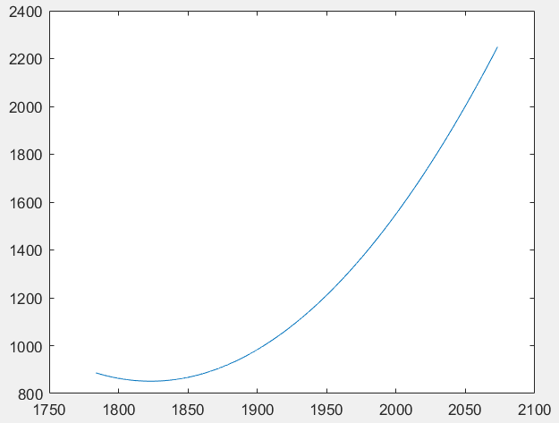

#<center>插值建模-数值实验报告4</center>
<center>数据科学与计算机学院（软件工程） 郑卓民 18342138</center>

## 实验内容：
对递增的3个数据点$(1783.7151, 886.1973)$、$(1895.0712, 967.1026)$和$(1996.7213, 1525.1511)$，尝试用各种的定义域$(1783.7151, 2073.1026)$上的递增函数（其应为3未知量/参数函数）进行插值建模，并进行自变量区间为$(2019.7856, 2073.1026)$的外插值计算与画图。

## 实验过程：
本次插值建模问题与实验报告2类似，插值概念不再赘述，本次实验提供的信息增加了一个数据点，并且需要注意的是本次实验的三个数据点是完整的（给出完整横/纵坐标），并且规定了建模递增函数的定义域以及要利用插值多项式求得的自变量区间对应的值。

实验步骤可分为：函数建模——求出具体插值多项式——对多项式作图已方便观察图像信息。

函数建模方面，由于给定了三个数据点，我们考虑从简单非线性函数入手过渡到特殊非线性函数。

#### 二次函数：

**假设函数模型为：**$f(x) = Ax^2 + Bx + C$

代入$(1783.7151, 886.1973)$、$(1895.0712, 967.1026)$和$(1996.7213, 1525.1511)$：

$\left\{\begin{array}{l}{886.1973=1783.7151^2 A+1783.7151 B+C} \\ {967.1026=1895.0712^2 A+1895.0712 B+C} \\ {1525.1511=1996.7213^2 A+1996.7213 B+C}\end{array}\right.$

$\left\{\begin{array}{l}{A=0.02236249688} \\ {B=-81.54030142034} \\ {C=75181.45951046164}\end{array}\right.$

**Matlab:**
```
>> format long
>> y = [886.1973; 967.1026; 1525.1511];
>> x = [1783.7151^2 1783.7151 1; 1895.0712^2 1895.0712 1; 1996.7213^2 1996.7213 1];
>> z = pinv(x)*y
z =
   1.0e+04 *
   0.000002236249688
  -0.008154030142034
   7.518145951046164
```

对于自变量区间$(2019.7856, 2073.1026)$，选取边缘两点为特殊点并进行代入计算：

$f(2019.7856) = 1716.096325108418$

$f(2073.1026) = 2248.567775716278$

**Matlab:**
```
>> x = [2019.7856^2 2019.7856 1];
>> x*z
ans =
     1.716096325108418e+03
>> x = [2073.1026^2 2073.1026 1];
>> x*z
ans =
     2.248567775716278e+03
```

**作图：**
```
>> x = 1783.7151:0.01:2073.1026;
>> y = 0.02236249688*x.^2 -81.54030142034*x + 75181.45951046164;
>> plot(x, y)
```



> 在定义域中，大体呈递增趋势，但仍有一个小区间为递减趋势。

#### 三次函数：

**假设函数模型为：**$f(x) = Ax^3 + Bx + C$

代入$(1783.7151, 886.1973)$、$(1895.0712, 967.1026)$和$(1996.7213, 1525.1511)$：

$\left\{\begin{array}{l}{886.1973=1783.7151^3 A+1783.7151 B+C} \\ {967.1026=1895.0712^3 A+1895.0712 B+C} \\ {1525.1511=1996.7213^3 A+1996.7213 B+C}\end{array}\right.$

$\left\{\begin{array}{l}{A=0.00000394018} \\ {B=-39.27885174419} \\ {C=48587.4356167123}\end{array}\right.$

**Matlab:**
```
>> y = [886.1973; 967.1026; 1525.1511];
>> x = [1783.7151^3 1783.7151 1; 1895.0712^3 1895.0712 1; 1996.7213^3 1996.7213 1];
>> z = pinv(x)*y
z =
   1.0e+04 *
   0.000000000394018
  -0.003927885174419
   4.858743561671230
```

对于自变量区间$(2019.7856, 2073.1026)$，选取边缘两点为特殊点并进行代入计算：

$f(2019.7856) = 1718.771881958732$

$f(2073.1026) = 2264.073033970286$

**Matlab:**
```
>> x = [2019.7856^3 2019.7856 1];
>> x*z
ans =
     1.718771881958732e+03
>> x = [2073.1026^3 2073.1026 1];
>> x*z
ans =
     2.264073033970286e+03
```

**作图：**
```
>> x = 1783.7151:0.01:2073.1026;
>> y = 0.00000394018*x.^3 -39.27885174419*x + 48587.4356167123;
>> plot(x,y)
```


> 在定义域中，大体呈递增趋势，但仍有一个小区间为递减趋势。

#### 四次函数：

**假设函数模型为：**$f(x) = Ax^4 + Bx^2 + C$

代入$(1783.7151, 886.1973)$、$(1895.0712, 967.1026)$和$(1996.7213, 1525.1511)$：

$\left\{\begin{array}{l}{886.1973=1783.7151^4 A+1783.7151^2 B+C} \\ {967.1026=1895.0712^4 A+1895.0712^2 B+C} \\ {1525.1511=1996.7213^4 A+1996.7213^2 B+C}\end{array}\right.$

$\left\{\begin{array}{l}{A=0.000000000140000766} \\ {B=-0.000192534413167371} \\ {C=-0.000000000108143384}\end{array}\right.$

**Matlab:**
```
>> y = [886.1973; 967.1026; 1525.1511];
>> x = [1783.7151^4 1783.7151^2 1; 1895.0712^4 1895.0712^2 1; 1996.7213^4 1996.7213^2 1];
>> z = pinv(x)*y
z =
   1.0e-03 *
   0.000000140000766
  -0.192534413167371
  -0.000000108143384
```

对于自变量区间$(2019.7856, 2073.1026)$，选取边缘两点为特殊点并进行代入计算：

$f(2019.7856) = 1544.525604622399$

$f(2073.1026) = 1758.445512568496$

**Matlab:**
```
>> x = [2019.7856^4 2019.7856^2 1];
>> x*z
ans =
     1.544525604622399e+03
>> x = [2073.1026^4 2073.1026^2 1];
>> x*z
ans =
     1.758445512568496e+03
```

**作图：**
```
>> x = 1783.7151:0.01:2073.1026;
>> y = 0.000000000140000766*x.^4 -0.000192534413167371*x.^2 + -0.000000000108143384;
>> plot(x,y)
```


> 在定义域中，函数满足严格单调递增。

#### 五次函数：

**假设函数模型为：**$f(x) = Ax^5 + Bx^3 + Cx$

代入$(1783.7151, 886.1973)$、$(1895.0712, 967.1026)$和$(1996.7213, 1525.1511)$：

$\left\{\begin{array}{l}{886.1973=1783.7151^5 A+1783.7151^3 B+1783.7151 C} \\ {967.1026=1895.0712^5 A+1895.0712^3 B+1895.0712 C} \\ {1525.1511=1996.7213^5 A+1996.7213^2 B+1996.7213 C}\end{array}\right.$

$\left\{\begin{array}{l}{A=0.0000000000000526776487} \\ {B=-0.0000000261996164688385} \\ {C=-0.0000000000000146829642}\end{array}\right.$

**Matlab:**
```
>> y = [886.1973; 967.1026; 1525.1511];
>> x = [1783.7151^5 1783.7151^3 1783.7151; 1895.0712^5 1895.0712^3 1895.0712; 1996.7213^5 1996.7213^3 1996.7213];
>> z = pinv(x)*y
z =
   1.0e-07 *
   0.000000526776487
  -0.261996164688385
  -0.000000146829642
```

对于自变量区间$(2019.7856, 2073.1026)$，选取边缘两点为特殊点并进行代入计算：

$f(2019.7856) = 1554.852435062977$

$f(2073.1026) = 1783.683277376346$

**Matlab:**
```
>> x = [2019.7856^5 2019.7856^3 2019.7856];
>> x*z
ans =
     1.554852435062977e+03
>> x = [2073.1026^5 2073.1026^3 2073.1026];
>> x*z
ans =
     1.783683277376346e+03
```

**作图：**
```
>> x = 1783.7151:0.01:2073.1026;
>> y = 0.0000000000000526776487*x.^5 -0.0000000261996164688385*x.^3 -0.0000000000000146829642*x;
>> plot(x,y)
```


> 在定义域中，函数满足严格单调递增。

#### 指数函数：

**假设函数模型一为：**$f(x) = Ae^{x/1000} + Bx^2 + Cx$

代入$(1783.7151, 886.1973)$、$(1895.0712, 967.1026)$和$(1996.7213, 1525.1511)$：

$\left\{\begin{array}{l}{886.1973=e^{1.7837151} A+1783.7151^2 B+1783.7151C} \\ {967.1026=e^{1.8950712} A+1895.0712^2 B+1895.0712C} \\ {1525.1511=e^{1.9967213} A+1996.7213^2 B+1996.7213C}\end{array}\right.$

$\left\{\begin{array}{l}{A=12655.77957381679} \\ {B=-0.01964079008} \\ {C=-6.69959526810}\end{array}\right.$

**Matlab:**
```
>> y = [886.1973; 967.1026; 1525.1511];
>> x = [exp(1.7837151) 1783.7151^2 1783.7151; exp(1.8950712) 1895.0712^2 1895.0712; exp(1.9967213) 1996.7213^2 1996.7213];
>> z = pinv(x)*y
z =
   1.0e+04 *
   1.265577957381679
  -0.000001964079008
  -0.000669959526810
```

对于自变量区间$(2019.7856, 2073.1026)$，选取边缘两点为特殊点并进行代入计算：

$f(2019.7856) = 1725.911997361774$

$f(2073.1026) = 2306.232281188462$

**Matlab:**
```
>> x = [exp(2.0197856) 2019.7856^2 2019.7856];
>> x*z
ans =
     1.725911997361774e+03
>> x = [exp(2.0731026) 2073.1026^2 2073.1026];
>> x*z
ans =
     2.306232281188462e+03
```

**作图：**
```
>> x = 1783.7151:0.01:2073.1026;
>> y = 12655.77957381679*exp(x./1000) -0.01964079008*x.^2 -6.69959526810*x;
>> plot(x,y)
```


> 在定义域中，大体呈递增趋势，但仍有一个小区间为递减趋势。

**假设函数模型二为：**$f(x) = Ae^{x/100} + Bx^2 + Cx$

代入$(1783.7151, 886.1973)$、$(1895.0712, 967.1026)$和$(1996.7213, 1525.1511)$：

$\left\{\begin{array}{l}{886.1973=e^{17.837151} A+1783.7151^2 B+1783.7151C} \\ {967.1026=e^{18。950712} A+1895.0712^2 B+1895.0712C} \\ {1525.1511=e^{19.967213} A+1996.7213^2 B+1996.7213C}\end{array}\right.$

$\left\{\begin{array}{l}{A=0.000002615710266} \\ {B=-0.001249962823517} \\ {C=2.644587863726040}\end{array}\right.$

**Matlab:**
```
>> y = [886.1973; 967.1026; 1525.1511];
>> x = [exp(17.837151) 1783.7151^2 1783.7151; exp(18.950712) 1895.0712^2 1895.0712; exp(19.967213) 1996.7213^2 1996.7213];
>> z = pinv(x)*y
z =
   0.000002615710266
  -0.001249962823517
   2.644587863726040
```

对于自变量区间$(2019.7856, 2073.1026)$，选取边缘两点为特殊点并进行代入计算：

$f(2019.7856) = 1788.938223779076$

$f(2073.1026) = 2746.556331559353$

**Matlab:**
```
>> x = [exp(20.197856) 2019.7856^2 2019.7856];
>> x*z
ans =
     1.788938223779076e+03
>> x = [exp(20.731026) 2073.1026^2 2073.1026];
>> x*z
ans =
     2.746556331559353e+03
```

**作图：**
```
>> x = 1783.7151:0.01:2073.1026;
>> y = 0.000002615710266*exp(x./100) -0.001249962823517*x.^2 +2.644587863726040*x;
>> plot(x,y)
```


> 效果比“假设一”要好

## 实验总结：

经过多次假设插值模型以及数值计算与作图分析，可知若想满足在给定定义域实现严格单调递增，并且能在自变量区间取得较好的插值效果，那么插值模型的设定应尽量为较高增长速率的函数，建议为四次多项式（或更高次），否则可能需要对插值多项式模型进行参数调整才能满足算得的插值多项式满足在对应区间严格单调递增。

