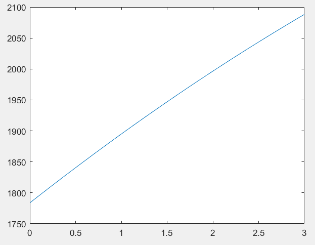
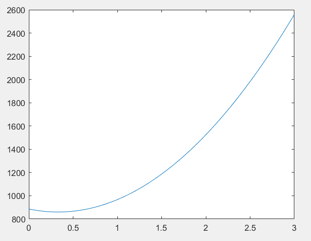
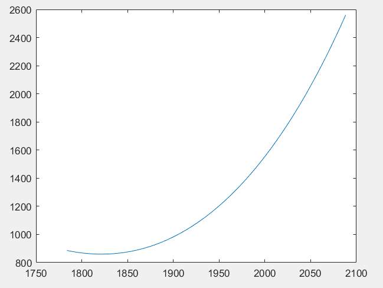
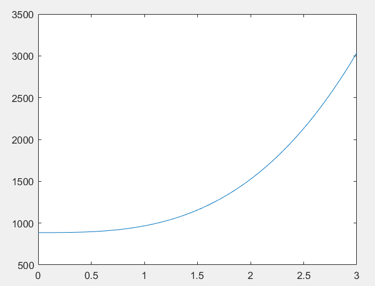
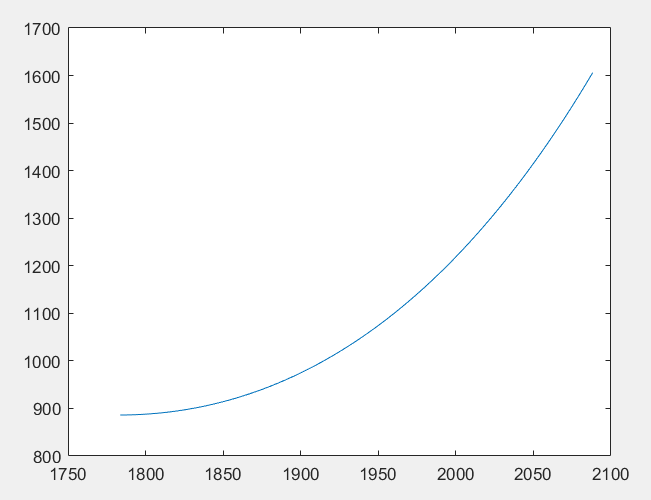
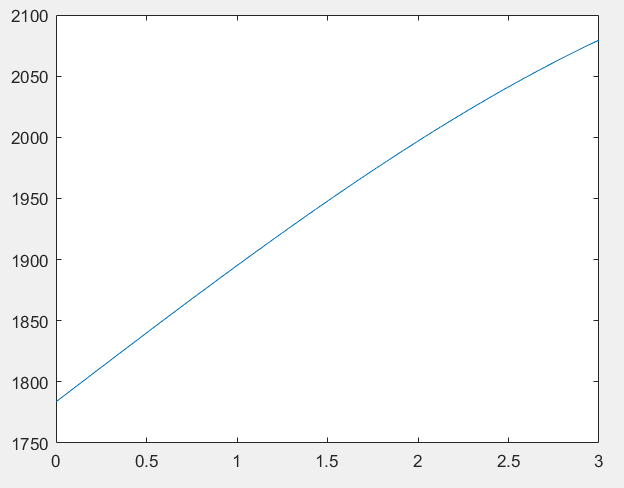
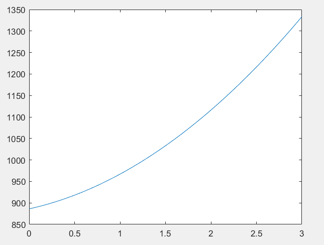
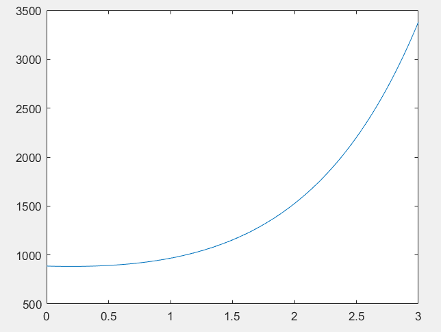
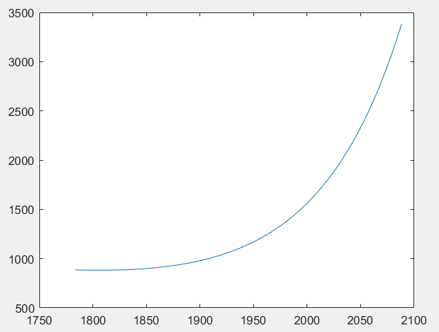

#<center>插值建模-数值实验报告5</center>
<center>数据科学与计算机学院（软件工程） 郑卓民 18342138</center>

## 实验内容：
对$(x,y)$形式的递增的3个数据点$(1783.7151, 886.1973)$、$(1895.0712, 967.1026)$和$(1996.7213, 1525.1511)$，定义一个新的自变量如索引次数$t$（其可为0或1或2或3或4），尝试用各种$t$定义域上的递增函数（其应为3未知量/参数函数）分别进行$x$和$y$的插值建模，并外插出下一个点的$x$和$y$的值。

## 实验原理：
报告5的插值建模看似与报告2和4的插值建模有很大的区别，但其实本质是一样的，只不过在这次实验中，每次建模需要对$x$和$y$分别假设一个插值多项式模型，然后代入运算后得到两条插值多项式，其中这两条插值多项式的自变量是我们自己设定的$t$，因变量分别是$x$和$y$。

## 实验过程：
通过上面实验原理中对实验内容的分析，我们自然可循规开展从非线性简单模型到特殊模型的数值建模实验。

但是在本实验中，区别于前面两次插值实验的做法，我们对于$x$和$y$的插值多项式模型的假设不一定要用同次的模型，但需要保证两个模型都是有且仅有三个未知参数，例如，对于$x$的假设我们设定为二次函数模型，对于$y$的假设我们可以设定为三次函数模型。

> 全局假设：定义一个新的自变量：索引次数$t$（其值为0或1或2或3），$t_0$、$t_1$、$t_2$对应给定的三个数据点，$t_3$对应我们要外插出的下一点。

以下所有尝试分三步进行，首先求出$x$的插值多项式，后求出$y$的插值多项式，最后作图：

#### 尝试一：x对应二次函数，y对应二次函数：

**假设$x-t$的函数模型为**： $x = At^2 + Bt + C$

代入$(0, 1783.7151)$、$(1, 1895.0712)$和$(2, 1996.7213)$：

$\left\{\begin{array}{l}{1783.7151=0 A+0 B+C} \\ {1895.0712=1^2 A+1 B+C} \\ {1996.7213=2^2 A+2 B+C}\end{array}\right.$

$\left\{\begin{array}{l}{A=-4.9} \\ {B=116.2} \\ {C=1783.7}\end{array}\right.$

```
>> y = [1783.7151; 1895.0712; 1996.7213];
>> t = [0 0 1; 1 1 1; 4 2 1];
>> z = pinv(t)*y
z =
   1.0e+03 *
   -0.0049
    0.1162
    1.7837
```

**外插出第四个点的x值**: $2088.2$

```
>> y = -4.9*3^2 + 116.2*3 + 1783.7
y =
   2.0882e+03
```

**作图**：(可见效果不错，严格单调递增)
```
>> t = 0:0.01:3;
>> y = -4.9*t.^2 + 116.2*t + 1783.7;
>> plot(t,y)
```


**假设$y-t$的函数模型为**： $y = At^2 + Bt + C$

代入$(0, 886.1973)$、$(1, 967.1026)$和$(2, 1525.1511)$：

$\left\{\begin{array}{l}{886.1973=0 A+0 B+C} \\ {967.1026=1^2 A+1 B+C} \\ {1525.1511=2^2 A+2 B+C}\end{array}\right.$

$\left\{\begin{array}{l}{A=238.5716} \\ {B=-157.6663} \\ {C=886.1973}\end{array}\right.$

```
>> y = [886.1973; 967.1026; 1525.1511];
>> t = [0 0 1; 1 1 1; 4 2 1];
>> z = pinv(t)*y
z =
  238.5716
 -157.6663
  886.1973
```

**外插出第四个点的y值**: $2560.3$

```
>> y = 238.5716*3^2 -157.6663*3 + 886.1973
y =
   2.5603e+03
```

**作图**：(整个区间不是严格单调递增，但是在0，1，2，3四个离散点是递增趋势的)

第四个点为：$(2088.2, 2560.3)$
```
>> t = 0:0.01:3;
>> y = 238.5716*t.^2 -157.6663*t + 886.1973;
>> plot(t,y)
```



**结合x和y的插值多项式作图**：三个给定点及一个预测点是严格递增的

```
>> t = 0:0.01:3;
>> x = -4.9*t.^2 + 116.2*t + 1783.7;
>> y = 238.5716*t.^2 -157.6663*t + 886.1973;
>> plot(x,y)
```



#### 尝试二：x对应二次函数，y对应三次函数：

**假设$x-t$的函数模型为**： $x = At^2 + Bt + C$

$x-t$的插值多项式与尝试一中的一致。**第四个点的x值**: $2088.2$

**假设$y-t$的函数模型为**： $y = At^3 + Bt + C$

代入$(0, 886.1973)$、$(1, 967.1026)$和$(2, 1525.1511)$：

$\left\{\begin{array}{l}{886.1973=0 A+0 B+C} \\ {967.1026=1^3 A+1 B+C} \\ {1525.1511=2^3 A+2 B+C}\end{array}\right.$

$\left\{\begin{array}{l}{A=79.5239} \\ {B=1.3814} \\ {C=886.1973}\end{array}\right.$

```
>> y = [886.1973; 967.1026; 1525.1511];
>> t = [0 0 1; 1 1 1; 8 2 1];
>> z = pinv(t)*y
z =
   79.5239
    1.3814
  886.1973
```

**外插出第四个点的y值**: $3037.5$

```
>> y = 79.5239*3^3 +1.3814*3 + 886.1973
y =
    3.0375e+03
```

**作图**：(整个区间严格单调递增)
```
>> t = 0:0.01:3;
>> y = 79.5239*t.^3 +1.3814*t + 886.1973;
>> plot(t,y)
```



**结合x和y的插值多项式作图**：

第四个点为：$(2088.2, 3037.5)$
```
>> t = 0:0.01:3;
>> x = -4.9*t.^2 + 116.2*t + 1783.7;
>> y = 79.5239*t.^2 +1.3814*t + 886.1973;
>> plot(x,y)
```




#### 尝试三：x对应三次函数，y对应四次函数：

**假设$x-t$的函数模型为**： $x = At^3 + Bt + C$

代入$(0, 1783.7151)$、$(1, 1895.0712)$和$(2, 1996.7213)$：

$\left\{\begin{array}{l}{1783.7151=0 A+0 B+C} \\ {1895.0712=1^3 A+1 B+C} \\ {1996.7213=2^3 A+2 B+C}\end{array}\right.$

$\left\{\begin{array}{l}{A=-1.6} \\ {B=113} \\ {C=1783.7}\end{array}\right.$

```
>> y = [1783.7151; 1895.0712; 1996.7213];
>> t = [0 0 1; 1 1 1; 8 2 1];
>> z = pinv(t)*y
z =
   1.0e+03 *
   -0.0016
    0.1130
    1.7837
```

**外插出第四个点的x值**: $2079.5$

```
>> y = -1.6*3^3 + 113*3 + 1783.7
y =
   2.0795e+03
```

**作图**：(可见效果不错，严格单调递增)
```
>> t = 0:0.01:3;
>> y = -1.6*t.^3 + 113*t + 1783.7;
>> plot(t,y)
```


**假设$y-t$的函数模型为**： $y = At^4 + Bt + C$

代入$(0, 886.1973)$、$(1, 967.1026)$和$(2, 1525.1511)$：

$\left\{\begin{array}{l}{886.1973=0 A+0 B+C} \\ {967.1026=1^4 A+1 B+C} \\ {1525.1511=2^4 A+2 B+C}\end{array}\right.$

$\left\{\begin{array}{l}{A=34.0817} \\ {B=46.8236} \\ {C=886.1973}\end{array}\right.$

```
>> y = [886.1973; 967.1026; 1525.1511];
>> t = [0 0 1; 1 1 1; 16 2 1];
>> z = pinv(t)*y
z =
   34.0817
   46.8236
  886.1973
```

**外插出第四个点的y值**: $3787.3$

```
>> y = 34.0817*3^4 +46.8236*3 + 886.1973
y =
   3.7873e+03
```

**作图**：(区间严格单调递增)

第四个点为：$(2079.5, 3787.3)$
```
>> t = 0:0.01:3;
>> y = 34.0817*t.^2 +46.8236*t + 886.1973;
>> plot(t,y)
```



**结合x和y的插值多项式作图**：三个给定点及一个预测点是严格递增的

```
>> t = 0:0.01:3;
>> x = -4.9*t.^2 + 116.2*t + 1783.7;
>> y = 238.5716*t.^2 -157.6663*t + 886.1973;
>> plot(x,y)
```


#### 尝试四：x对应二次函数，y对应指数函数：

**假设$x-t$的函数模型为**： $x = At^2 + Bt + C$

$x-t$的插值多项式与尝试一中的一致。**第四个点的x值**: $2088.2$

**假设$y-t$的函数模型为**： $y = Ae^{t} + Bt + C$

代入$(0, 886.1973)$、$(1, 967.1026)$和$(2, 1525.1511)$：

$\left\{\begin{array}{l}{886.1973=e^0 A+0 B+C} \\ {967.1026=e^1 A+1 B+C} \\ {1525.1511=e^2 A+2 B+C}\end{array}\right.$

$\left\{\begin{array}{l}{A=161.6069} \\ {B=-196.7809} \\ {C=724.5904}\end{array}\right.$

```
>> y = [886.1973; 967.1026; 1525.1511];
>> t = [exp(0) 0 1; exp(1) 1 1; exp(2) 2 1];
>> z = pinv(t)*y
z =
  161.6069
 -196.7809
  724.5904
```

**外插出第四个点的y值**: $3380.2$

```
>> y = 161.6069*exp(3) -196.7809*3 + 724.5904
y =
    3.3802e+03
```

**作图**：(整个区间严格单调递增)
```
>> t = 0:0.01:3;
>> y = 161.6069*exp(t) -196.7809*t + 724.5904;
>> plot(x,y)
```



**结合x和y的插值多项式作图**：

第四个点为：$(2088.2, 3380.2)$
```
>> t = 0:0.01:3;
>> x = -4.9*t.^2 + 116.2*t + 1783.7;
>> y = 161.6069*exp(t) -196.7809*t + 724.5904;
>> plot(x,y)
```




## 实验总结：

在本次实验中，每次插值建模的尝试都假设了两条插值多项式模型，分别对应$x$和$y$，经过上述尝试，我们可以看到：对$x$的建模可为二次及以上的函数模型且模型最好添加一个一次的$t$用于调整, 使得图像在所需区间趋于严格单调递增；对于$y$的建模，如果想使得最后$(x,y)$的图像在区间内严格单调递增，$y$的建模函数的增长速率应该为$x$的建模函数的两倍或以上，同样的，为了让$y-t$的图像尽量趋于严格单调递增，也可添加一个一次的$t$在建模函数中。